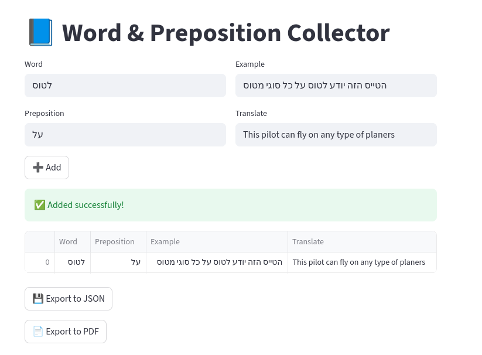

# 📘 Word & Preposition Collector



A simple Streamlit web app for collecting words, prepositions, examples, and translations — designed to help language learners (especially for English ↔ Hebrew study).  
You can easily add new entries, view them in a table, and export your data to **JSON** or **PDF**.

---

## 🚀 Features

- 📝 Add new entries (Word, Preposition, Example, Translation)
- 📊 View all saved items in a clean table
- 💾 Export to **JSON**
- 📄 Export to **PDF** (supports Hebrew and other Unicode text)
- 🔤 Full UTF-8 compatibility — perfect for multilingual vocabulary

---

## 🧰 Installation

1. Clone the repository:
   ```bash
   git clone https://github.com/yourusername/word-preposition-collector.git
   cd word-preposition-collector
